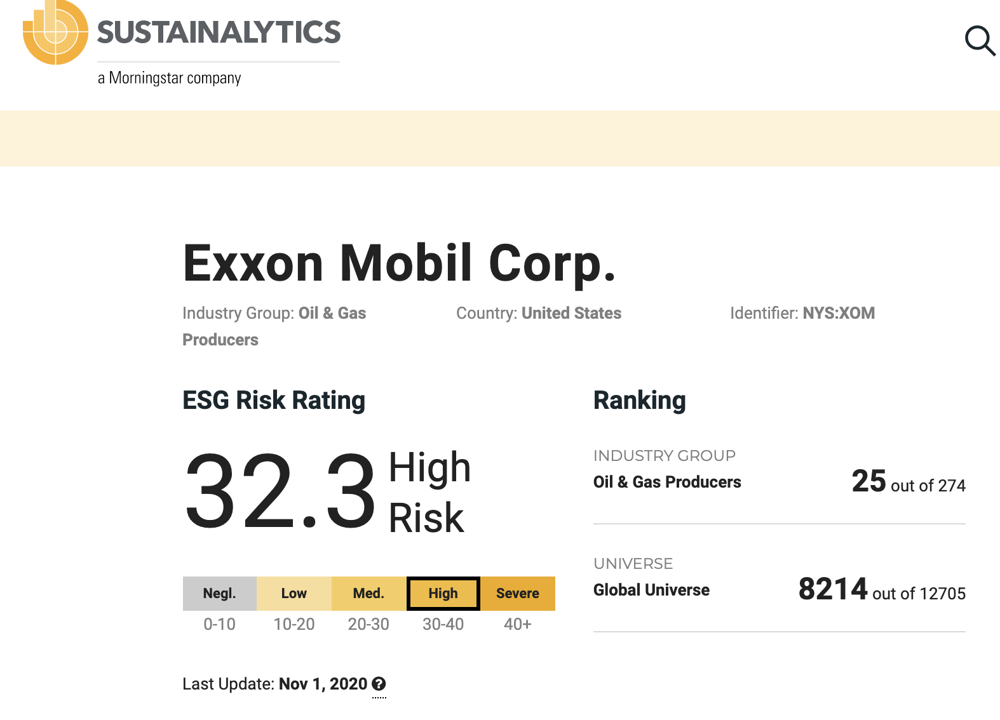

```{r setup, include=FALSE}
knitr::opts_chunk$set(echo = TRUE, fig.align="center")
library(tidyverse)
library(kableExtra)
library(lme4)
library(viridis)
library(maps)
library(leaflet)

# read in all datasets that are used in code chunks below

# ESG ratings and companies, Used for US Choropleth 
esg <- read_csv('ESG_data2.csv')

# Used for boxplot and regression analysis
esg_grouped <- read_csv('ESG_grouped.csv')

# summnary of regression results
regression <- read_csv('regression_data.csv')

# Top 100 global sustaiunability, used for Leaflet 
WorldData <- read_csv('worldData.csv')
```

# An Introduction to Sustainability


## Planet, People, Profits  


In the context of individual and corporate practices, _Sustainability_ refers
to making decisions that have a positive long-term impact on global and local environments.
More specifically, sustainable companies are those that achieve their current goals 
without jeopardizing the way of life of future generations. The concept of sustainability
and 'sustainable practices' is broken up into three areas, or pillars:

**1. Environmental (Planet)**

Decisions and processes that protect the environment. This includes reducing waste
production, water usage, and carbon footprints. 

**2. Social (People)**

Having a positive impact on employees and human well-being: workers' rights, company
benefits (insurance, paid leave), resources (education, training), avoiding child labor,
fundraising and community outreach efforts, investing in public projects.

**3. Economic (Profits)**

Refers to the importance of profits: a sustainable company must also be profitable
to ensure that its efforts are not short-lived. Also refers to government subsidies
and legislation that may encourage sustainable business practices.

These pillars are often used to evaluate the overall sustainability of a company's
practices, plans, and strategies. 

Examples of sustainable efforts:

- General Motors, Volkswagen, and BMW, and other car manufacturers introducing
electric vehicles
- Nike and Adidas reducing water, paper, and energy usage. Both
brands have introduced shoes made out of recycled materials. 
- Patagonia using recycled cans and bottles to make the polyester for many of its
clothing items
- The United Kingdom subsidizing battery production for electric vehicles 


## Why it Matters

So, why should businesses care about sustainability? For one, there in a moral and
ethical responsibility surrounding how we (both individuals and corporations) make
decisions and achieve our goals, as these decisions have a direct impact on present
and future communities. Moreover, corporate strategy is able to have a very significant
impact, both positive and negative, on global health and future environmental outcomes. 
For example, the 1.6 million kilometer mass of plastic floating in the Pacific Ocean
can be attributed to companies using cheap plastic materials to manufacture and 
package their products. Additionally, CO2 emissions from manufacturing and 
traditional energy plants contribute to increases in the earth's temperature, 
which is projected to cause rising sea levels and destructive natural disasters. 


Sustainability efforts also have monetary motivations. Many CEOs, consumer researchers, 
and businesses analysts have found that sustainable business practices may be crucial
for maintaining market share and revenue growth. 

Consumers tend to make purchases that align with their beliefs and values, and these
values often involve climate change and positive impacts on the environment. A survey
from Cone Communications found that **87%** of American consumers will purchase
something from a company if it advocated for an issue that they care about, and that
**63%** of Americans want corporations to drive social and environmental change.

Moreover, sustainable goods are projected to be growing market. A
2018 report from Nielsen Global Media found that **$128.5 billion** was spent on 
sustainable goods and products in 2018 and estimated that this number will reach 
**$150 billion by 2021.** Nielsen attributes much of this growth to Millenial consumers, 
who are more likely to change their shopping habits and are willing to pay more 
for products that are environmentally 'friendly.' As Millenials gradually make a 
larger and larger proportion of the consumer market, sustainability will become more
and more of a necessity for companies that want to maintain market share and brand
loyalty. 

## Our Question

With the increasing importance of sustainability on a company's reputation, marketing
strategies, and market share, we aim to investigate and quantify the impacts that sustainability
efforts have on a company's growth and economic success, as well as the prevalence
of sustainable companies throughout the U.S. and throughout the world. An understanding
of how sustainable strategies affect corporate growth and profits throughout different
industries and sectors can be useful information for investors, entrepreneurs, 
and current business leaders who wish to take advantage of sustainability's
continuing growth and relevance in the corporate sphere. 


# Sustainability in U.S. Companies 

## Our Data: ESG Scores and Fortune 100 Companies

### Environmental, Social, and Governance (ESG)

_ESG_ refers to a set of criteria that investors, fund managers, and research
analysts use to evaluate a company's practices and strategies from three different
perspectives: environmental impact, relationship with communities and employees, 
and financial and managerial ethics (shareholders' rights, insider trading). Investors
and professional asset managers use ESG research and systems of ESG 'ratings' to 
screen for ESG investing opportunities — both for themselves and for clients. 


Public (ie. free) ESG data is typically very hard to come by, as it's often
used by professional and retail investors to help make profitable investment decisions.
As a result, ESG research companies, like [Sustainalytics](https://www.sustainalytics.com/esg-ratings/) 
generally charge a (several hundred dollar) subscription fee to gain access to their large sets of ESG data 
and research reports. However, Sustainalytics does have a free ESG Rating search tool that returns ESG Risk 
Ratings for any publicly-traded company. 



To collect these ESG scores, we used a web-scraping bot that utilizes Selenium software. 
The bot enters the desired company name into the ESG tool's search bar and then
scrapes the corresponding ESG Risk Rating. This provided us with a method to collect
ESG scores for a collection of companies of our choosing. 

### Top 75 U.S. Companies

We pulled revenue, revenue growth, industry name, and headquarters data for the largest revenue generating companies in the U.S., with the exception of 13 companies which are not publicly traded (and 
thus did not have ESG scores available). We chose to investigate 
top-revenue-earning companies because they are (arguably) the most
successful companies in the U.S. and therefore likely have the most influence and presence
among U.S. corporate activity. Furthermore, these companies make up many factions of American life from E-Commerce to Oil to Food and Beverages. These companies have far reaching economic, social, and environmental implications, thus it's essential to consider their efforts to combat climate change, foster equality, and impart positive changes, not only in America, but globally. 

Once we had our dataset of U.S. companies, we passed each of their names into the
Selenium bot to their respective ESG Risk Ratings. 


 

### ESG Across U.S. Sectors

To address our first question — How does Sustainability vary among industries and 
sectors? — we assigned each of the top-75 companies to one of five sector 'groups.'
The sector group assignments followed the criteria below:

```{r assignments, echo = TRUE, warning = FALSE, message = FALSE, eval= FALSE}
# group similar sectors together for stat analyses
esg_grouped <- esg %>%
  mutate(sector_group = case_when(
    sector == 'Communication Services' |
      sector == 'Telecommunications' |
      sector == 'Technology' ~ "Tech, Telecomm, and Communications",
    sector == 'Consumer Discretionary' |
      sector == 'Consumer Staples' ~ 'Consumer Disc. and Staples',
    sector == 'Financials' ~ 'Financials',
    sector == 'Energy' |
      sector == 'Materials' |
      sector == 'Industrials' ~ 'Energy, Materials, and Industrials',
    sector == 'Health Care' ~ 'Health Care'))
```

Sectors were grouped together if their respective companies carried out similar functions
or provided similar goods/services. This was done because, originally, we had some
individual sectors (such as Materials) that had very few observations, and this would
have prevented us from moving forward with any statistical analyses. 

To start, we compared the medians and spreads of ESG Risk Ratings among our five sector
groups using a box plot. The plot and table below reveal that the Energy, Materials, 
and Industrials group has the highest mean and median risk rating, while the
Tech, Telecomm, and Communications group has the lowest mean and median rating. 

```{r US Sectors, echo=FALSE, warning=FALSE, message=FALSE}

# esg by Sector Group; Boxplot 
box <- ggplot(data = esg_grouped, aes(y = sector_group, x = esg)) +
  geom_boxplot() +
  ggtitle('ESG Score by Sector Group') +
  labs(x = 'ESG Score', y = 'Sector Group') +
  theme_light()
box + theme(legend.position = "none")

# modify data for table output
esg_table <- esg_grouped %>%
  group_by(sector_group) %>%
  summarize('mean_score' = mean(esg), 'median_score' = median(esg), 
            'std_deviation' = sd(esg)) %>%
  arrange(desc(median_score))

# table of ESG stats by Sector Group
kable(esg_table, digits = 4, format = "html", row.names = FALSE,
      col.names = c('Sector Group', 'Mean Score', 'Median Score',
                               'Std. Deviation'), 
      caption = 'ESG Score by Sector Group') %>%
  kable_styling(bootstrap_options = c("striped", "hover"),
                full_width = F,
                font_size = 14,
                position = "left")
```

For our next question — whether Sustainability efforts have an impact on corporate revenues —
we conducted a linear regression with ESG Risk Rating as a predictor variable and 
revenue growth as the response variable. When checking linearity and normality 
assumptions, we found that the relationship between revenue growth and esg rating
is not very linear, regardless if log or square root transformations are applied. 
Similarly, we found that applying log and square root transformations did not resolve
the lack of normality in our predictor and response variables; the log transformation
appeared to improve normality in for revenue growth in some sector groups, but we reasoned
that this improvement was marginal, and ultimately decided to proceed with the original,
untransformed data. We recognize that these assumptions — normality and linearity —
are not fully met and recognize the limitations of our results going forward. 

### Transformations {.tabset}

#### No Transformations

```{r no transformations,  echo=FALSE, warning=FALSE, message=FALSE}

# point plot for linearity 
gpoint_check <- ggplot(data = esg_grouped, aes(x = esg, y = revenue_growth)) +
  geom_point() + 
  facet_wrap(~ sector_group) +
  labs(x = 'ESG Risk Rating', y = 'Revenue Growth (%)')


gpoint_check

```

#### Log Transformations

```{r log transformations,  echo=FALSE, warning=FALSE, message=FALSE}
# check linearity 
gpoint_check2 <- ggplot(data = esg_grouped, aes(x = log(esg), y = log(revenue_growth))) +
  geom_point() + 
  facet_wrap(~ sector_group) +
  labs(x = 'ESG Risk Rating', y = 'Revenue Growth (%)')

gpoint_check2
```

#### Square Root Transformations

```{r sqrt transformations,  echo=FALSE, warning=FALSE, message=FALSE}
# check linearity 
gpoint_check3 <- ggplot(data = esg_grouped, aes(x = sqrt(esg), y = sqrt(revenue_growth))) +
  geom_point() + 
  facet_wrap(~ sector_group) +
  labs(x = 'ESG Risk Rating', y = 'Revenue Growth (%)')

gpoint_check3
```

### Impact on Revenue Growth
```{r Regressions, echo=FALSE, warning=FALSE, message=FALSE}
# point plot of revenue growth and ESG Score -- colored by sector 

gpoint <- ggplot(data = esg_grouped, aes(x = esg, y = revenue_growth)) +
  geom_point(aes(color = sector_group)) +
  stat_smooth(aes(group = sector_group, color = sector_group), method = "lm", se = FALSE) +
  ggtitle('ESG Risk Rating and Revenue Growth') +
  labs(x = 'ESG Risk Rating', y = 'Revenue Growth (%)', color = 'Sector Group') +
  theme_light()
gpoint + theme(legend.position="bottom", legend.direction = 'vertical')

# table output for regression results

kable(regression, digits = 4, row.names = FALSE,
      caption = 'Linear Regression: ESG Risk Rating Predicting Revenue Growth (Revenue Growth ~ ESG)') %>%
  kable_styling(bootstrap_options = c("striped", "hover"),
                full_width = F,
                font_size = 14,
                position = "left")
```

Our regressions on each sector group yielded positive estimates for the ESG coefficient
for three groups and negative estimates for two groups; however, only the estimate
for _Tech, Telecomm, adn Communications_ was found to be significant at the 0.05 
confidence level. This was fairly expected since we had a relatively small number
of observations within each sector group, as well difficulty meeting the linearity 
and normality assumptions. An aggregate/ungrouped regression on all of the companies
yielded a positive coefficient estimate and was significant at the 0.10 confidence
level. 

An interesting result is that our significant coefficient estimate for Tech, Telecomm, 
and Communications was positive. Indeed, even though most of our estimates were 
insignificant at the 0.05 level, the majority of them were positive, rather than negative. 
This seems to contradict the literature that sustainability efforts are a driver
of market share and sales growth. However, the companies in our dataset are 
top-earners and are therefore not very representative of the average corporation 
in the U.S. With this and our assumption violations in mind, we recognize that 
these results may not be indicative of a negative association between sustainability
efforts and prospective revenue growth. 

To address our last question regarding the location of sustainable companies in the 
U.S., we constructed a choropleth map colored by average ESG Risk Rating. That is, 
the color of each state on the map below reflects the average ESG Risk Rating
of all the top-75 companies that are headquartered in that state. 

### ESG in the U.S.
```{r US Map, echo=FALSE, warning=FALSE, message=FALSE}


#Wrangling Datasets for US Map output
USData <- esg %>%
  select(esg, State) %>%
  group_by(State) %>%
  summarize(ESG = mean(esg)) %>%
  mutate(State = tolower(State))
States <- map_data(map = "state"
                       , region = ".") 
#Merging with Map Dataset
USMap <- USData %>%
  right_join(States, by = c("State" = "region")) 
#Creating Map
ggplot(USMap, aes(x = long, y = lat, group = group
                      , fill = ESG)) +
  geom_polygon(color = "white") +
  theme_void() +
  coord_fixed(ratio = 1.3) +
  labs(title = "Which States House Sustainable Companies?"
       , subtitle = "The average ESG Risk Rating of companies headquartered in each state."
       , caption = "*Grey states do not contain a Top-75 Company"
       , fill = "Average ESG Risk Rating") +
  scale_fill_viridis(option = "brewer blues", direction = -1)

```

### {.tabset}

#### Highest Risk States

```{r high risk, echo=FALSE, warning=FALSE, message=FALSE}
# wrangle data for table output -- highest risk states
USData_table_high <- esg %>%
  select(esg, State) %>%
  group_by(State) %>%
  summarize(ESG = mean(esg)) %>%
  arrange(desc(ESG)) %>%
  head(3)

kable(head(USData_table_high), digits = 4, row.names = FALSE,
      caption = 'States with Highest Average ESG Risk',
      col.names = c('State', 'Average Company ESG Risk Rating')) %>%
  kable_styling(bootstrap_options = c("striped", "hover"),
                full_width = F,
                font_size = 14,
                position = "left")

# collect / wrangle companies in these high risk states, table output
high_states <- esg_grouped %>%
  filter(State == 'Virginia' | State == 'Arkansas' | State == 'Illinois') %>%
  select(name, State, esg, sector_group) %>%
  arrange(desc(esg)) %>%
  head(3)

kable(head(high_states), digits = 4, row.names = FALSE,
      caption = 'Companies in High Risk States',
      col.names = c('Name', 'State', 'ESG Risk Rating', 'Sector Group')) %>%
  kable_styling(bootstrap_options = c("striped", "hover"),
                full_width = F,
                font_size = 14,
                position = "left")

```

#### Lowest Risk States

```{r low risk, echo=FALSE, warning=FALSE, message=FALSE}

# wrangle data for table output -- lowest risk states
USData_table_low <- esg %>%
  select(esg, State) %>%
  group_by(State) %>%
  summarize(ESG = mean(esg)) %>%
  arrange(ESG) %>%
  head(3)

kable(head(USData_table_low), digits = 4, row.names = FALSE,
      caption = 'States with Lowest Average ESG Risk',
      col.names = c('State', 'Average Company ESG Risk Rating')) %>%
  kable_styling(bootstrap_options = c("striped", "hover"),
                full_width = F,
                font_size = 14,
                position = "left")

# collect / wrangle companies in these low risk states, table output
low_states <- esg_grouped %>%
  filter(State == 'Indiana' | State == 'Minnesota' | State == 'Pennsylvania') %>%
  select(name, State, esg, sector_group) %>%
  arrange(esg) %>%
  head(3)

kable(head(low_states), digits = 4, row.names = FALSE,
      caption = 'Companies in Low Risk States',
      col.names = c('Name', 'State', 'ESG Risk Rating', 'Sector Group')) %>%
  kable_styling(bootstrap_options = c("striped", "hover"),
                full_width = F,
                font_size = 14,
                position = "left")

```


# Global Sustainability


## Global Knights 100 Data

Our Global Sustainability data set comes from the annual Global Knights 100 2020, which measures public companies throughout the globe with over $1 Billion in revenue annually based on their resource, employee, and financial management. These companies represent the top scoring in all of these categories throughout the World. The data is publicly available each year and thus we simply scraped the page from the website. We then used this information to plot the location of the top 100 companies which have great impact and are taking great strides in sustainability practices, financial allotment, and employee treatment throughout the globe.  

## Most Sustainable Companies in the World

```{r Global, echo=FALSE, warning=FALSE, message=FALSE}
#Global Sustainability Leaflet

GlobalData <- WorldData %>%
  select(Company, Country) %>%
  mutate(`Country` = ifelse(`Country` == 'CA','Canada',`Country`)) %>%
  mutate(`Country` = ifelse(`Country` == 'U.S.','USA',`Country`)) %>%
  mutate(`Country` = as.character(`Country`)) %>%
  mutate(`Country` = gsub(" ","",`Country`))
#Adding Map Data
WorldMap <- map_data(map = "world", region = ".") %>%
  select(region, lat, long, group) %>%
  group_by(region) %>%
  summarize(long = mean(long),lat = mean(lat)) %>%
  rename(`Country` = region) %>%
  mutate(`Country` = gsub(" ","",`Country`))
#Merging Datasets
GlobalMap <- GlobalData %>%
  inner_join(WorldMap) %>%
  group_by(Country, long, lat) %>%
  summarize(Companies = paste(Company, collapse = "<br>"), count = n())
#Creating Global Sustainability Leaflet
GlobalLeaflet <- leaflet(GlobalMap) %>%
  addTiles() %>%
  addCircleMarkers(lat = ~lat
                   , lng = ~long
                   , popup = GlobalMap$Companies
                   , stroke = FALSE 
                   , radius = ~count
                   , fillOpacity = 0.9) 
GlobalLeaflet
```

# Conclusion

To summarize our findings we saw that within US companies, the Energy, Materials, and Industrial sectors displayed the highest overall ESG scores. We then saw that Technology, Telecommunications, and Media had the lowest average ESG scores. Worldwide, we can see a heavy concentration of the most sustainable companies in the US and Europe. 

We faced large limitations in the scope of data available to report for our project. This was mainly due to the amount of free and publicly available information on companies in the US and Globally. We were only able to record 87 of the top 100 companies by revenue in the US because 13 of them were not publicly traded and thus did not have ESG scores to report. Subsequently, we were limited to exploring sustainability within large companies because most smaller and mid-sized companies do not have publicly available data regarding sustainability metrics or revenue. However, with respect to the scope of our project this was not too problematic since we really wanted to look at how the largest companies with the most environmental, social, and economic impact handle sustainability and other metrics. 

Thus, we limited the scope of our project, which has made it's applicability a bit more narrow. If we were able to access a broader scope of data for private and smaller sized companies our US company metrics would have been more indicative of the state of sustainability and responsibility for the country as a whole. Many of the smaller companies have less resources and thus face more challenges in implementing environmental and social practices which are often costly and time-intensive. Our data is certainly skewed in that it represents companies with incredibly vast resources and abilities to implement whatever changes they see fit. We also could have looked more comprehensively at sustainability on a global scale if we had access to more information and there was a standardized metric by which companies are measured in regard to sustainability and social responsibility. ESG scores are currently the most standardized and publicly available numbers we have, but it certainly presents many limitations in access and companies which subscribe to these ratings. 

Overall, we were still able to access ample data with regards to the most influential players in the US and many globally, thus our data and visuals were able to reveal a lot of important notions about the state of sustainability and social responsibility in the world. 

## What's Next?

With global climate change looming and cities becoming increasingly polluted and environmentally troubled, companies must use their resources and power to combat the crisis as best they can. Changing political tides within the US will likely have some influence on the effort and regulations regarding sustainable and ethical practices in business and many countries throughout the world have already begun to implement stricter regulations and encouraged better practices. The difficulty of accessing data regarding sustainability raises an alarming question of the ability for the public to hold companies accountable for their actions and encourage change when necessary. Thus, it's imperative the more standardized metrics are established and public reporting becomes mandatory, otherwise it's impossible for the public to understand and acknowledge the great positive and detrimental impacts many companies are causing to the world. Unsurprisingly, the global data revealed the traditionally wealthier and more developed countries house the most environmentally conscious companies which likely indicates the money and power required to implement better practices. This raises the concern that improving business practices is inaccessible for many and we must find a way to encourage and orchestrate economically feasible solutions to ineffective processes. As a society, we are moving in the right direction by generally recognizing institutional problems regarding social and environmental responsibility in business, but we must have more access and widely availible resources to truly move forward and impact the world in a powerful way. 

### Sources

#### Background

https://www.imd.org/research-knowledge/articles/why-all-businesses-should-embrace-sustainability/
https://online.maryville.edu/blog/importance-of-environmental-awareness-when-running-a-business/
https://www.businessinsider.com/companies-using-recycled-plastic-in-products
https://www.bizjournals.com/bizwomen/news/latest-news/2018/12/millennials-drive-big-growth-in-sustainable.html?page=all
https://www.investopedia.com/terms/s/sustainability.asp
https://www.investopedia.com/articles/investing/100515/three-pillars-corporate-sustainability.asp#:~:text=Sustainability%20is%20most%20often%20defined,as%20people%2C%20planet%20and%20profits.
https://www.investopedia.com/terms/e/environmental-social-and-governance-esg-criteria.asp

#### Images
https://www.lifealth.com/wellness/healthy-living/world-environment-day-2018-easy-ways-take-care-environment-av/77189/
https://www.businessinsider.com/companies-using-recycled-plastic-in-products
https://chiletoday.cl/floating-garbage-patches-grow-in-the-pacific-ocean/

#### ESG Ratings
https://www.sustainalytics.com/esg-ratings/


